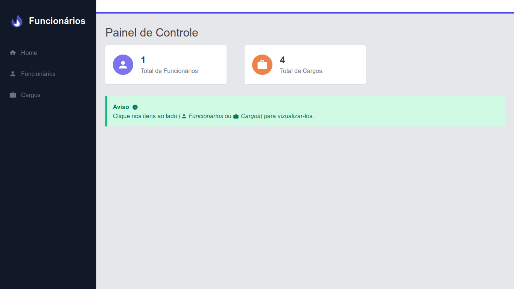
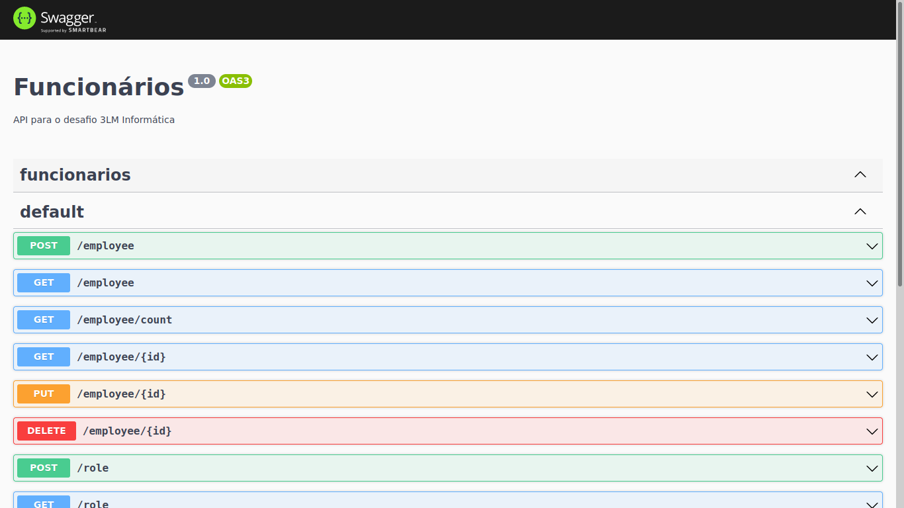

# Desafio 3LM Informática

## Início Rápido

Para utilizar esse projeto em sua máquina é necessário ter instalado [Node.JS](https://nodejs.org/en/) e o Banco de dados Relacional [MySQL](https://www.mysql.com/)

## Acesso Online

## Imagens




## Rodando o Projeto

### Backend

- Variáveis de Ambiente do Banco de Dados

  - Dentro de /backend
  - Renomeie o arquivo .env-example para .env
  - Adicione as variáveis relacionadas ao Banco de Dados

- Rodando o Projeto

```bash
$ cd backend

$ npm install

$ npm run start:dev
```

Acesse: http://localhost:3000

### Frontend

- Variável de Ambiete de url da API

  - Dentro de /frontend
  - Renomeie o arquivo .env.local-example para .env.local
  - Adicione a URL da API

- Rodando o projeto

```bash
$ cd frontend

$ npm install

$ npm run dev
```

Acesse: http://localhost:3001

## Tecnologias

- [x] [Next.js](https://nextjs.org/)
- [x] [Nest.js](https://nestjs.com/)
- [x] [Tailwindcss](https://tailwindcss.com/)
- [x] [TypeORM](https://typeorm.io/#/)
- [x] [Swagger](https://swagger.io/)
